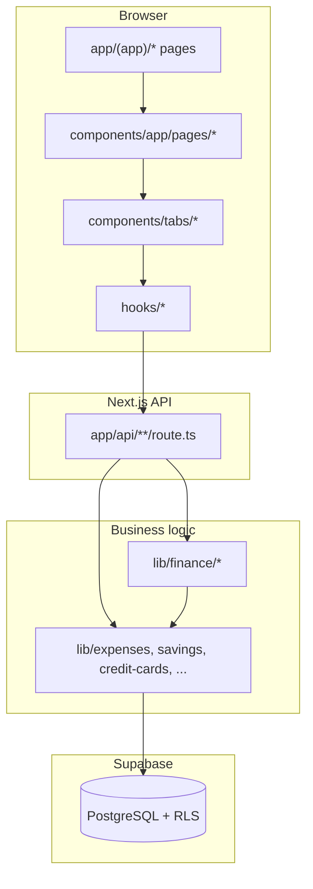
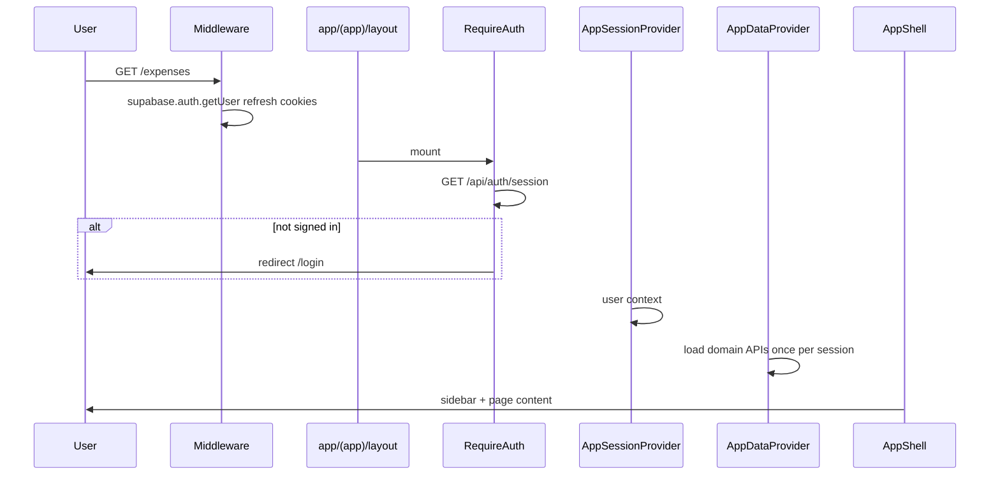

# 02 — Architecture

## Layered design

| Layer | Responsibility |
|-------|----------------|
| **Pages** | Thin `page.tsx` files that render route wrappers |
| **Route wrappers** | Wire `DomainPage` / props into tab components |
| **Tabs** | Feature UI, forms, tables |
| **Hooks** | Fetch/mutate via `fetchJson`, hold local state |
| **API routes** | Auth, validation, HTTP status codes |
| **lib/** | Queries, calculations, ledger rules, migrations |
| **PostgreSQL** | Persistence + RLS |

## Authenticated app shell

Key files:

- [webapp/app/(app)/layout.tsx](../webapp/app/(app)/layout.tsx)
- [webapp/components/RequireAuth.tsx](../webapp/components/RequireAuth.tsx)
- [webapp/contexts/AppSessionContext.tsx](../webapp/contexts/AppSessionContext.tsx)
- [webapp/contexts/AppDataProvider.tsx](../webapp/contexts/AppDataProvider.tsx)
- [webapp/hooks/useAppData.ts](../webapp/hooks/useAppData.ts)

## Client state composition

`useAppData` does **not** load one giant JSON blob anymore. It parallel-fetches domain endpoints and builds an in-memory [DashboardState](../webapp/lib/types.ts) for:

- Budget / cashflow / projection calculators in `lib/finance/*`
- Tabs that still accept `state` / `setState` props

| Data | Typical API | Persisted in |
|------|-------------|--------------|
| Prefs (view options, etc.) | `GET/PUT /api/state` | `dashboard_state` |
| Profile, insurance, ILP | `/api/profile` | `user_finance_profile`, policies tables |
| Budget lines | `/api/budget-lines` | `budget_lines` |
| Loans | `/api/loans` | `loans` |
| Other loans | `/api/other-loans` | `other_loans` |
| Credit cards | `/api/credit-cards` | `credit_cards` |
| Holdings | `/api/holdings` | `holdings` |
| Savings bundle | `/api/savings`, `/api/accounts` | savings tables |

**Loaded on demand** (not in `AppDataProvider`):

- Expenses — `/api/expenses`, `/api/expenses/summary`
- Unified transactions — `/api/transactions`
- Card statements — `/api/credit-cards/statements`
- Travel, poker — respective APIs

## Legacy migration path

On first `GET /api/state` after upgrade:

1. [webapp/app/api/state/route.ts](../webapp/app/api/state/route.ts) reads `dashboard_state.data`.
2. If full legacy snapshot and not `_migrated_v2`, [webapp/lib/migrate-all-domains.ts](../webapp/lib/migrate-all-domains.ts) writes rows to normalized tables.
3. Blob replaced with `{ prefs, _migrated_v2: true }`.

Subsequent saves to `/api/state` only update **preferences**, not loans/cards/etc.

## API route pattern

Typical handler flow:

1. `if (!isSupabaseAuthConfigured())` → `{ configured: false }` or 503
2. `const auth = await requireSessionUser()` → 401 if missing
3. `createAuthedSupabaseClient()` → user-scoped queries (RLS)
4. Delegate to `lib/*`
5. `console.info('[api/...]', { ... })` for observability

## Cross-cutting domains

### Financial accounts (pay-from)

[webapp/lib/financial-accounts/sync.ts](../webapp/lib/financial-accounts/sync.ts) mirrors:

- Each `user_savings_accounts` row → `financial_accounts` (`account_type: cash`)
- Each `credit_cards` row → `financial_accounts` (`account_type: credit_card`)

Expenses and payments reference `financial_account_id`. Card tracked spend keys off the card’s linked financial account.

### Ledgers

Three transaction-like tables serve different roles — see [06-ledgers-and-transactions.md](./06-ledgers-and-transactions.md).

### Credit cards

Statement cycles, tracked spend, and payments — see [07-credit-cards-and-statements.md](./07-credit-cards-and-statements.md).

## Event-based UI refresh

Some tabs listen for browser events to avoid stale data:

- `expenses-changed` — dispatched after expense create/delete ([webapp/components/tabs/TabExpenses.tsx](../webapp/components/tabs/TabExpenses.tsx)); [webapp/hooks/useCardStatements.ts](../webapp/hooks/useCardStatements.ts) reloads statements silently
- `visibilitychange` — card statements reload when tab becomes visible again

## Testing

Unit tests colocated as `*.test.ts` under `lib/` (Vitest). API routes are thin; prefer testing `lib/` modules.

## Related docs

- [03-routes-and-api.md](./03-routes-and-api.md)
- [05-database-schema.md](./05-database-schema.md)
- [08-authentication-and-security.md](./08-authentication-and-security.md)
