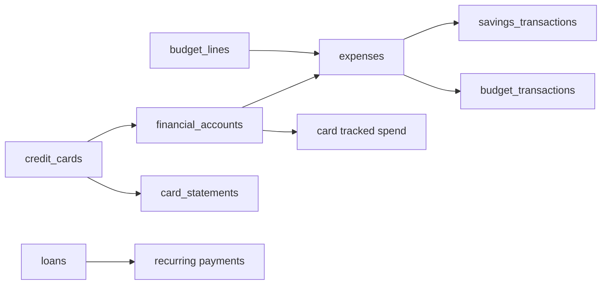

# 04 — Features by navigation area

Organized to match [webapp/lib/nav-config.ts](../webapp/lib/nav-config.ts). Each section lists UI, APIs, core `lib/` modules, and primary database tables.

---

## Overview

### This Month (`/this-month`)

**Purpose:** Monthly calendar with statement due amounts, recurring events, and card cycle context.

| Layer | Location |
|-------|----------|
| UI | [webapp/components/tabs/TabThisMonth.tsx](../webapp/components/tabs/TabThisMonth.tsx) |
| APIs | `/api/summary`, `/api/credit-cards/calendar`, `/api/recurring-subscriptions` |
| lib | [webapp/lib/finance/calendar.ts](../webapp/lib/finance/calendar.ts), [webapp/lib/recurring/calendar-events.ts](../webapp/lib/recurring/calendar-events.ts), [webapp/lib/credit-cards/card-statements/calendar-load.ts](../webapp/lib/credit-cards/card-statements/calendar-load.ts) |
| Tables | `credit_cards`, `card_statements`, `loans`, `recurring_subscriptions` |

### This Month Cashflow (`/this-month-cashflow`)

**Purpose:** Single-month money in vs out including subscriptions and card bills due.

| Layer | Location |
|-------|----------|
| UI | [webapp/components/tabs/TabThisMonthCashflow.tsx](../webapp/components/tabs/TabThisMonthCashflow.tsx) |
| APIs | `/api/recurring-subscriptions`, profile/budget via `useAppData` |
| lib | [webapp/lib/finance/cashflow.ts](../webapp/lib/finance/cashflow.ts) |

---

## Planning

### Budget (`/budget`)

**Purpose:** Take-home vs budget categories; links to loans/insurance from other tabs.

| Layer | Location |
|-------|----------|
| UI | [webapp/components/tabs/TabBudgetSavings.tsx](../webapp/components/tabs/TabBudgetSavings.tsx) |
| APIs | `/api/budget-lines`, `/api/state`, `/api/profile` |
| lib | [webapp/lib/finance/budget.ts](../webapp/lib/finance/budget.ts), [webapp/lib/budget/load.ts](../webapp/lib/budget/load.ts) |
| Tables | `budget_lines`, `user_finance_profile` |

### Savings & Goals (`/savings`)

**Purpose:** Personal accounts, household pools, goals, pool transactions.

| Layer | Location |
|-------|----------|
| UI | [webapp/components/tabs/TabSavings.tsx](../webapp/components/tabs/TabSavings.tsx) |
| APIs | `/api/savings`, `/api/savings/pools/[id]/transactions` |
| lib | [webapp/lib/savings/load-bundle.ts](../webapp/lib/savings/load-bundle.ts), [webapp/lib/savings/ledger.ts](../webapp/lib/savings/ledger.ts) |
| Tables | `user_savings_accounts`, `savings_pools`, `savings_goals`, `savings_transactions` |

### 5-Month Cashflow (`/now`)

**Purpose:** Forward cashflow with fixed spend, debt, insurance, surplus allocation.

| Layer | Location |
|-------|----------|
| UI | [webapp/components/tabs/TabNow.tsx](../webapp/components/tabs/TabNow.tsx) |
| lib | [webapp/lib/finance/cashflow.ts](../webapp/lib/finance/cashflow.ts), [webapp/lib/income/hybrid-cashflow.ts](../webapp/lib/income/hybrid-cashflow.ts) |
| APIs | `/api/cashflow/additive-income`, domain data via `useAppData` |

### 5-Year Projection (`/year`)

**Purpose:** Long-term wealth scenarios using budget, CPF, investments.

| Layer | Location |
|-------|----------|
| UI | [webapp/components/tabs/TabYear.tsx](../webapp/components/tabs/TabYear.tsx) |
| lib | [webapp/lib/finance/projections.ts](../webapp/lib/finance/projections.ts), [webapp/lib/finance/wealth.ts](../webapp/lib/finance/wealth.ts) |

### BTO Planner (`/bto`)

**Purpose:** Flat price, grants, loan, downpayment, cash required.

| Layer | Location |
|-------|----------|
| UI | [webapp/components/tabs/TabBTO.tsx](../webapp/components/tabs/TabBTO.tsx) |
| lib | [webapp/lib/finance/bto.ts](../webapp/lib/finance/bto.ts) |
| Storage | `user_finance_profile.bto_planner` (jsonb) |

---

## Tracking

### Expenses (`/expenses`)

**Purpose:** Monthly budget vs actual by category; manual spend entry with pay-from account.

| Layer | Location |
|-------|----------|
| UI | [webapp/components/tabs/TabExpenses.tsx](../webapp/components/tabs/TabExpenses.tsx), [CategoryBudgetCard.tsx](../webapp/components/expenses/CategoryBudgetCard.tsx) |
| APIs | `GET /api/expenses/summary?ym=`, `POST/DELETE /api/expenses` |
| lib | [webapp/lib/expenses/budget-summary.ts](../webapp/lib/expenses/budget-summary.ts), [ledger-sync.ts](../webapp/lib/expenses/ledger-sync.ts) |
| Tables | `expenses`, `budget_lines`, `budget_transactions` (imports only in summary) |

See [06-ledgers-and-transactions.md](./06-ledgers-and-transactions.md).

### Recurring (`/recurring`)

**Purpose:** Mark debt, insurance, ILP, and custom subscription payments paid each month.

| Layer | Location |
|-------|----------|
| UI | [webapp/components/tabs/TabRecurring.tsx](../webapp/components/tabs/TabRecurring.tsx), [RecordRecurringPaymentForm.tsx](../webapp/components/expenses/RecordRecurringPaymentForm.tsx) |
| APIs | `/api/recurring?ym=`, `/api/recurring-subscriptions`, `POST /api/expenses` (auto payment) |
| lib | [webapp/lib/recurring/build-rows.ts](../webapp/lib/recurring/build-rows.ts), [webapp/lib/expenses/auto-payment.ts](../webapp/lib/expenses/auto-payment.ts) |
| Tables | `expenses` (auto_category), `loans`, `insurance_policies`, `ilp_policies`, `recurring_subscriptions` |

### Transaction history (`/transactions`)

**Purpose:** Unified, filterable list of savings, budget, and expense records.

| Layer | Location |
|-------|----------|
| UI | [webapp/components/savings/TransactionsHistoryPage.tsx](../webapp/components/savings/TransactionsHistoryPage.tsx) |
| API | `GET /api/transactions`, PATCH/DELETE/reimburse on `[recordType]/[id]` |
| lib | [webapp/lib/transactions/unified.ts](../webapp/lib/transactions/unified.ts), [webapp/lib/transactions/actions.ts](../webapp/lib/transactions/actions.ts) |

### Travel (`/travel`, `/travel/[id]`)

**Purpose:** Trips with per-category budgets and linked expenses.

| Layer | Location |
|-------|----------|
| UI | [TabTravel.tsx](../webapp/components/tabs/TabTravel.tsx), [TabTravelTrip.tsx](../webapp/components/tabs/TabTravelTrip.tsx) |
| APIs | `/api/travel/trips`, budgets, expenses |
| lib | [webapp/lib/travel/](../webapp/lib/travel/) |
| Tables | `travel_trips`, `travel_trip_budgets`, `expenses` (via trip API) |

### Poker (`/poker`, `/poker/stats`)

**Purpose:** Session log, venues, game types, optional cash ledger link, statistics.

| Layer | Location |
|-------|----------|
| UI | [TabPoker.tsx](../webapp/components/tabs/TabPoker.tsx), [PokerStatsPage.tsx](../webapp/components/poker/PokerStatsPage.tsx) |
| APIs | `/api/poker`, `/api/poker/stats`, games, locations |
| lib | [webapp/lib/poker/](../webapp/lib/poker/), [ledger-sync.ts](../webapp/lib/poker/ledger-sync.ts) |
| Tables | `poker_sessions`, `poker_locations`, `poker_games`, `savings_transactions` |

---

## Accounts

### Cash Accounts (`/cash-accounts`)

**Purpose:** Personal bank/cash jars, balances, transfers, net worth slice.

| Layer | Location |
|-------|----------|
| UI | [webapp/components/tabs/TabCashAccounts.tsx](../webapp/components/tabs/TabCashAccounts.tsx) |
| APIs | `/api/accounts`, `/api/accounts/[id]/transactions` |
| lib | [webapp/lib/savings/ledger.ts](../webapp/lib/savings/ledger.ts) |
| Tables | `user_savings_accounts`, `savings_transactions` |

### Credit Cards (`/cards`)

**Purpose:** Card portfolio, SG rewards catalog advisor, statement cycles, tracked vs actual spend, payments.

| Layer | Location |
|-------|----------|
| UI | [webapp/components/tabs/TabCards.tsx](../webapp/components/tabs/TabCards.tsx) |
| APIs | `/api/credit-cards`, `/api/credit-cards/statements`, statement pay/undo |
| lib | [webapp/lib/credit-cards/](../webapp/lib/credit-cards/), [webapp/lib/cards/](../webapp/lib/cards/), [webapp/lib/finance/card-rewards.ts](../webapp/lib/finance/card-rewards.ts) |
| Tables | `credit_cards`, `card_statements`, `financial_accounts` |

See [07-credit-cards-and-statements.md](./07-credit-cards-and-statements.md).

### Investment (`/wealth`)

**Purpose:** Holdings, live quotes, portfolio snapshots, ILP policies from profile.

| Layer | Location |
|-------|----------|
| UI | [webapp/components/tabs/TabWealth.tsx](../webapp/components/tabs/TabWealth.tsx) |
| APIs | `/api/holdings`, `/api/portfolio/snapshots`, `/api/quotes`, `/api/profile` (ILP) |
| lib | [webapp/lib/holdings/load.ts](../webapp/lib/holdings/load.ts), [webapp/lib/finance/ilp.ts](../webapp/lib/finance/ilp.ts) |
| Tables | `holdings`, `portfolio_snapshots`, `ilp_policies` |

### CPF Outlook (`/cpf`)

**Purpose:** OA/SA/MA balances for planning views.

| Layer | Location |
|-------|----------|
| UI | [webapp/components/tabs/TabCPF.tsx](../webapp/components/tabs/TabCPF.tsx) |
| lib | [webapp/lib/finance/cpf.ts](../webapp/lib/finance/cpf.ts) |
| Storage | `user_finance_profile` CPF fields |

### Debts & Loans (`/debt`)

**Purpose:** Instalment loans (often card-linked), other loans (personal, balance transfer), edit/save.

| Layer | Location |
|-------|----------|
| UI | [webapp/components/tabs/TabDebt.tsx](../webapp/components/tabs/TabDebt.tsx), [OtherLoansPanel.tsx](../webapp/components/debt/OtherLoansPanel.tsx) |
| APIs | `/api/loans`, `/api/other-loans`, `/api/other-loans/[id]/pay` |
| lib | [webapp/lib/finance/debt.ts](../webapp/lib/finance/debt.ts), [webapp/lib/other-loans/](../webapp/lib/other-loans/) |
| Tables | `loans`, `other_loans`, `credit_cards` |

---

## Configuration

### ME (`/me`)

**Purpose:** Salary, insurance (non-ILP), partner invites, dashboard JSON import/export, dummy data.

| Layer | Location |
|-------|----------|
| UI | [webapp/components/tabs/TabMe.tsx](../webapp/components/tabs/TabMe.tsx) |
| APIs | `/api/profile`, `/api/household`, `/api/partner/*`, `/api/state` |
| lib | [webapp/lib/profile/load.ts](../webapp/lib/profile/load.ts), [webapp/lib/household/](../webapp/lib/household/) |

---

## Cross-feature dependencies

## Related docs

- [03-routes-and-api.md](./03-routes-and-api.md)
- [05-database-schema.md](./05-database-schema.md)
- [06-ledgers-and-transactions.md](./06-ledgers-and-transactions.md)
