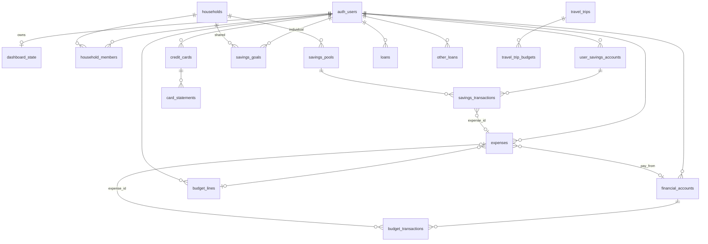

# 05 — Database schema

PostgreSQL schema is defined in [webapp/supabase/migrations/](../webapp/supabase/migrations/). Apply migrations **001 through 025 in order** in the Supabase SQL editor (or via CLI).

All application tables use **Row Level Security (RLS)** unless noted.

---

## Migration index

| # | File | Summary |
|---|------|---------|
| 001 | `001_dashboard_state.sql` | Legacy singleton `dashboard_state` (superseded by 002) |
| 002 | `002_per_user_auth.sql` | Per-user `dashboard_state`; renames 001 → `dashboard_state_legacy` |
| 003 | `003_couples_and_ledger.sql` | Households, savings accounts/pools/goals, `expenses`, RLS helpers |
| 004 | `004_accounts_ledger.sql` | `savings_transactions`, `include_in_savings` flags |
| 005 | `005_financial_accounts_budget.sql` | `financial_accounts`, `budget_transactions` |
| 006 | `006_credit_cards.sql` | `credit_cards` |
| 007 | `007_loans_budget.sql` | `loans`, `budget_lines` |
| 008 | `008_holdings_portfolio.sql` | `holdings`, `portfolio_snapshots` |
| 009 | `009_profile_insurance.sql` | `user_finance_profile`, `insurance_policies`, `ilp_policies` |
| 010 | `010_poker_sessions.sql` | `poker_sessions` |
| 011 | `011_expenses_budget_link.sql` | `budget_line_id` on expenses and budget_transactions |
| 012 | `012_auto_expense_payments.sql` | Auto-payment FKs on `expenses` |
| 013 | `013_recurring_subscriptions.sql` | `recurring_subscriptions`, subscription auto_category |
| 014 | `014_recurring_default_account.sql` | Default pay-from on loans/insurance/ilp |
| 015 | `015_expense_ledger_link.sql` | `expense_id` on savings and budget transactions |
| 016 | `016_income_categories.sql` | `income_categories`; income/poker ledger links |
| 017 | `017_card_statements.sql` | `card_statements`; APR on cards |
| 018 | `018_card_statement_minimum_due.sql` | `minimum_due` on statements |
| 019 | `019_other_loans.sql` | `other_loans` |
| 020 | `020_other_loans_exclude_networth.sql` | `exclude_from_net_worth` |
| 021 | `021_poker_tracker_enhancements.sql` | `poker_locations`, `poker_games`; session fields |
| 022 | `022_other_loans_bt_charge.sql` | Balance transfer charge + expense link |
| 023 | `023_travel.sql` | `travel_trips`, `travel_trip_budgets` |
| 024 | `024_expenses_spent_time.sql` | `spent_time` on `expenses` |
| 025 | `025_transactions_source_links.sql` | `source_record_type` / `source_record_id` on ledger tables |

---

## RLS patterns

| Pattern | Tables | Rule idea |
|---------|--------|-----------|
| **Owner** | Most tables | `user_id = auth.uid()` for ALL |
| **Household member** | `households`, `savings_pools`, shared goals | `is_household_member(household_id)` |
| **Split ledger** | `savings_transactions` | Personal account OR pool membership |
| **Partner invites** | `partner_invites` | Inviter full access; invitee can accept pending by email |

**Helper functions** (003, `security definer`):

- `public.is_household_member(hid uuid)`
- `public.my_household_id()`

---

## Entity relationship (core)

---

## Tables by domain

### App state

**`dashboard_state`** — `(user_id PK, data jsonb, updated_at)`  
Per-user UI preferences and migration flag `_migrated_v2`. Not the full dashboard anymore.

**`dashboard_state_legacy`** (optional) — Old singleton blob from 001; safe to drop after migration.

### Household

| Table | Key columns | Purpose |
|-------|-------------|---------|
| `households` | `id` | Couple container |
| `household_members` | `household_id`, `user_id` (unique user) | Membership |
| `partner_invites` | `household_id`, `invitee_email`, `status` | Email invites |

### Savings

| Table | Key columns | Purpose |
|-------|-------------|---------|
| `user_savings_accounts` | `balance`, `include_in_savings` | Personal cash jars |
| `savings_pools` | `household_id`, `balance` | Joint pools |
| `savings_goals` | `scope`, `owner_user_id` / `household_id`, targets | Goals |
| `savings_transactions` | `account_id` XOR `pool_id`, `kind`, `amount`, `occurred_at`, `expense_id`, `source_record_*` | Ledger |

### Expenses & budget

| Table | Key columns | Purpose |
|-------|-------------|---------|
| `expenses` | `amount`, `spent_at`, `spent_time`, `category`, `budget_line_id`, `auto_category`, source FKs, `financial_account_id` | Canonical spend |
| `budget_lines` | `category`, `amount`, `line_type` | Plan categories |
| `budget_transactions` | `financial_account_id`, `transaction_type`, `spent_at`, `expense_id`, `import_batch_id` | Card/import ledger |
| `recurring_subscriptions` | `amount`, `deduction_day`, `default_financial_account_id` | Subscription defs |
| `income_categories` | `slug`, `counts_in_baseline`, `counts_as_additive` | Income taxonomy |

### Financial accounts & cards

| Table | Key columns | Purpose |
|-------|-------------|---------|
| `financial_accounts` | `account_type` cash\|credit_card, `savings_account_id`, `card_key` | Pay-from targets |
| `credit_cards` | `card_key`, `statement_day`, `payment_due_day`, `financial_account_id`, rewards json | Card config |
| `card_statements` | cycle dates, `actual_amount`, `tracked_amount`, `amount_paid`, `payment_savings_transaction_id` | Billing cycles |

### Debt

| Table | Key columns | Purpose |
|-------|-------------|---------|
| `loans` | `monthly`, `outstanding`, `credit_card_id`, `deduction_day` | Instalment plans |
| `other_loans` | `loan_type`, BT fields, `finance_charge_expense_id`, `exclude_from_net_worth` | Informal / BT loans |

### Investments & profile

| Table | Key columns | Purpose |
|-------|-------------|---------|
| `holdings` | `ticker`, `market`, `qty`, `avg_cost` | Stocks |
| `portfolio_snapshots` | `total_value`, `recorded_at` | History |
| `user_finance_profile` | salary, CPF, `bto_planner` jsonb | Planning inputs |
| `insurance_policies` | `monthly_premium`, `deduction_day` | Insurance |
| `ilp_policies` | premiums, funds json | ILP |

### Poker & travel

| Table | Purpose |
|-------|---------|
| `poker_sessions`, `poker_locations`, `poker_games` | Session tracking |
| `travel_trips`, `travel_trip_budgets` | Trip planning |

---

## Important link columns

| Column | On | Points to |
|--------|-----|-----------|
| `expense_id` | `savings_transactions`, `budget_transactions` | `expenses.id` — ledger mirror; hidden from unified duplicate streams |
| `source_record_type` + `source_record_id` | ledger tables | Polymorphic link for reimbursements (025) |
| `payment_savings_transaction_id` | `card_statements` | Payment withdrawal row |
| `finance_charge_expense_id` | `other_loans` | One-time BT fee expense |

---

## TypeScript mappers

DB rows are mapped in domain packages, e.g.:

- [webapp/lib/savings/db-mappers.ts](../webapp/lib/savings/db-mappers.ts) — `mapExpense`, savings tx
- [webapp/lib/credit-cards/mappers.ts](../webapp/lib/credit-cards/mappers.ts) — cards
- [webapp/lib/budget/mappers.ts](../webapp/lib/budget/mappers.ts) — budget transactions
- [webapp/lib/credit-cards/card-statements/mappers.ts](../webapp/lib/credit-cards/card-statements/mappers.ts) — statements

Unified UI type: [webapp/lib/transactions/types.ts](../webapp/lib/transactions/types.ts) (`UnifiedTransaction`).

---

## Related

- [06-ledgers-and-transactions.md](./06-ledgers-and-transactions.md) — How expense and ledger tables interact
- [08-authentication-and-security.md](./08-authentication-and-security.md) — Auth + RLS usage from the app
