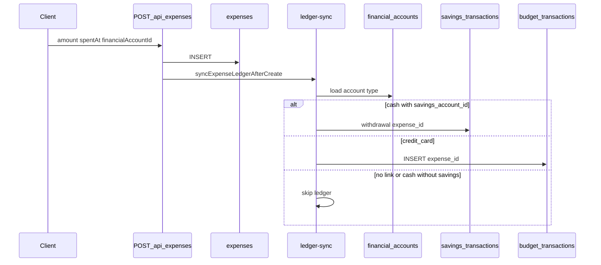
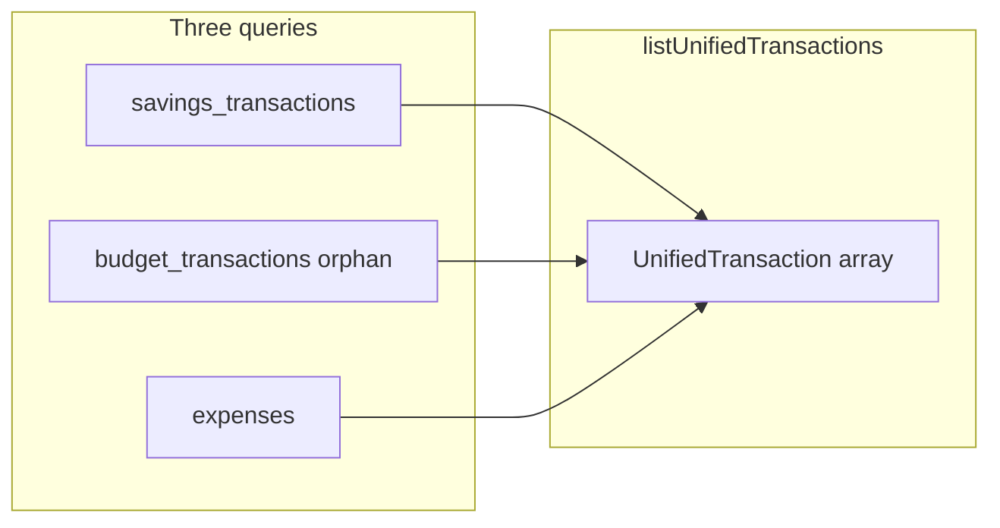

# 06 — Ledgers and transactions

The app uses **three related stores** for money movement. Understanding their roles avoids duplicate rows and explains transaction history behavior.

---

## Why three tables?

| Table | Canonical for | Typical source |
|-------|---------------|----------------|
| **`expenses`** | User-facing spend record (amount, category, date, note) | Expenses tab, recurring payments, travel API |
| **`savings_transactions`** | **Cash** balance changes (deposit / withdrawal / adjustment) | Cash account UI, card statement pay, expense pay-from cash |
| **`budget_transactions`** | **Credit card** ledger rows (and legacy CSV imports) | Expense pay-from card, old imports |

**`financial_accounts`** links pay-from: cash accounts point at `user_savings_accounts`; credit cards point at `credit_cards` via `card_key`.

---

## Create expense flow

**Implementation:**

- API: [webapp/app/api/expenses/route.ts](../webapp/app/api/expenses/route.ts)
- Sync: [webapp/lib/expenses/ledger-sync.ts](../webapp/lib/expenses/ledger-sync.ts), [webapp/lib/expenses/expense-ledger-api.ts](../webapp/lib/expenses/expense-ledger-api.ts)
- Cash ledger: [webapp/lib/savings/ledger.ts](../webapp/lib/savings/ledger.ts) (`applyTransaction`)

**Timestamps:** Default `spent_time` uses SGT ([webapp/lib/time/sgt.ts](../webapp/lib/time/sgt.ts)). Ledger `occurred_at` uses `sgtSpentAtToIso` (+08:00).

---

## Delete expense flow

`DELETE /api/expenses/[id]`:

1. `reverseExpenseLedger` — restores cash balance, deletes linked `savings_transactions` and `budget_transactions` by `expense_id`
2. Deletes `expenses` row
3. If auto debt payment, may restore loan `outstanding`

---

## Unified transaction history

**API:** `GET /api/transactions`  
**Logic:** [webapp/lib/transactions/unified.ts](../webapp/lib/transactions/unified.ts)

Merges three queries, sorts by `sortAt` descending:

| Stream | Source | Dedup rule |
|--------|--------|------------|
| `savings` | `listAllTransactions` | Excludes rows with `expense_id` set |
| `budget` | `listBudgetTransactions` | `.is('expense_id', null)` |
| `expense` | `listExpensesForTransactions` | All matching expenses |

So a card expense appears **once** as `recordType: expense`, not again as budget.

**Display time for expenses:** `spent_at` + `spent_time` anchored as SGT in [webapp/lib/expenses/list-for-transactions.ts](../webapp/lib/expenses/list-for-transactions.ts).

---

## Mutations on unified rows

| Action | Route | lib |
|--------|-------|-----|
| Update | `PATCH /api/transactions/[recordType]/[id]` | Per-type update |
| Delete | `DELETE ...` | [webapp/lib/transactions/actions.ts](../webapp/lib/transactions/actions.ts) — ledger-aware |
| Reimburse | `POST .../reimburse` | Creates offsetting ledger with `source_record_*` (025) |

Deleting a **savings** row that paid a card statement may sync statement state via [webapp/lib/credit-cards/card-statements/pay.ts](../webapp/lib/credit-cards/card-statements/pay.ts) (`syncStatementAfterPaymentTransactionDelete`).

---

## Expense summary (budget vs actual)

**API:** `GET /api/expenses/summary?ym=YYYY-MM`

[webapp/lib/expenses/budget-summary.ts](../webapp/lib/expenses/budget-summary.ts):

- **Manual:** rows from `expenses` (excluding `auto_category` for category buckets)
- **Import:** `budget_transactions` where `expense_id IS NULL` (standalone imports / card-only rows)

Auto-payment expenses (debt, insurance, ILP, subscription) roll into **computed** buckets via [webapp/lib/expenses/computed-categories.ts](../webapp/lib/expenses/computed-categories.ts).

---

## Auto payments (recurring)

**POST /api/expenses** with `autoCategory`:

| Category | Required FK | Budget label |
|----------|-------------|--------------|
| `debt` | `loanId` | Computed debt |
| `insurance` | `insurancePolicyId` | Computed insurance |
| `ilp` | `ilpPolicyId` | Computed ILP |
| `subscription` | `subscriptionId` | Computed subscription |

Validation: [webapp/lib/expenses/auto-payment.ts](../webapp/lib/expenses/auto-payment.ts). Debt payments adjust `loans.outstanding`.

---

## Other ledger writers

| Feature | Module | Table |
|---------|--------|-------|
| Card statement pay | `lib/credit-cards/card-statements/pay.ts` | `savings_transactions` + `card_statements` |
| Poker session | `lib/poker/ledger-sync.ts` | `savings_transactions` |
| Account / pool forms | `lib/savings/ledger.ts` | `savings_transactions` |
| CSV import | Disabled (`POST /api/transactions` → 410) | — |

---

## UI refresh

After expense changes, `window.dispatchEvent(new Event('expenses-changed'))` notifies [webapp/hooks/useCardStatements.ts](../webapp/hooks/useCardStatements.ts) to reload tracked card spend.

---

## Related

- [07-credit-cards-and-statements.md](./07-credit-cards-and-statements.md)
- [05-database-schema.md](./05-database-schema.md)
