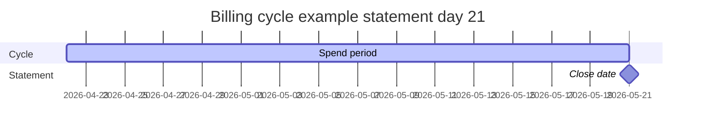

# 07 — Credit cards and statements

Credit card features combine **card configuration**, **billing cycles**, **tracked spend** from expenses, and **statement payments** from cash accounts.

---

## Data model

| Table | Role |
|-------|------|
| `credit_cards` | User’s cards: statement day, due day, APR, rewards metadata |
| `financial_accounts` | Pay-from row per card (`account_type: credit_card`, `card_key`) |
| `card_statements` | One row per statement close date per card |
| `expenses` | Spend with `financial_account_id` = card’s financial account |
| `budget_transactions` | Optional mirror when expense paid from card (`expense_id` set) |

Sync on card save: [webapp/lib/financial-accounts/sync.ts](../webapp/lib/financial-accounts/sync.ts) (`syncCreditCardFinancialAccountsFromRows`).

On statements load, missing `financial_account_id` is backfilled the same way ([loadCardStatementsBundle](../webapp/lib/credit-cards/card-statements/load.ts)).

---

## Billing cycle rules

**Source:** [webapp/lib/cards/statement-cycle.ts](../webapp/lib/cards/statement-cycle.ts)

For **statement day** = 21:

- Statement **closes** on the 21st
- Cycle **starts** the day after the previous close (22nd of prior month)
- Cycle **ends** on the close date (21st) inclusive

Example: close `2026-05-21` → cycle `2026-04-22` … `2026-05-21`.

**Open cycle** (current period): `openCycleBounds(statementDay, today)` → `cycleStart`, `cycleEnd`, `statementClose`.

**Spend assignment:** `statementCloseForSpend(spentAt, statementDay)` maps a transaction date to which statement it belongs (spend on close day counts toward that statement).

Stored on each `card_statements` row: `cycle_start_date`, `cycle_end_date`, `statement_close_date`, `payment_due_date`. Stale dates are corrected in `ensureStatementRows` when loading.

---

## Loading statements bundle

**API:** `GET /api/credit-cards/statements`  
**Core:** `loadCardStatementsBundle` in [webapp/lib/credit-cards/card-statements/load.ts](../webapp/lib/credit-cards/card-statements/load.ts)

Steps:

1. Ensure `financial_account_id` on all cards
2. `ensureStatementRows` — create/update last 12 statement closes per card
3. `buildCardSpendIndexMap` — aggregate spend by day per financial account ([webapp/lib/cards/statement-spend-index.ts](../webapp/lib/cards/statement-spend-index.ts))
4. For each card:
   - **Latest closed statement** — tracked spend in cycle, interest via `recomputeInterestForStatement`
   - **Open cycle** — `newSpend` = sum in current `cycleStart`…`cycleEnd`; carried forward + interest estimate

**Tracked spend** sums:

- `expenses` where `financial_account_id` matches and `spent_at` in range
- `budget_transactions` for same account where `expense_id IS NULL` and not income

Expense-linked budget rows are excluded to avoid double count (expense row already counted).

---

## UI surfaces

| Surface | Data |
|---------|------|
| Open cycle cards | `openCycles[]` — `newSpend`, `carriedForward`, `interestEstimate`, `daysLeftInCycle` |
| Statements table | `statements[]` — `actualAmount`, `trackedAmount`, `untrackedAmount`, pay/undo |
| Calendar (This Month) | `GET /api/credit-cards/calendar` |

**Client:** [webapp/hooks/useCardStatements.ts](../webapp/hooks/useCardStatements.ts), [webapp/components/tabs/TabCards.tsx](../webapp/components/tabs/TabCards.tsx).

**Refresh:** `expenses-changed` event + `visibilitychange` silent reload.

---

## Statement payment

**Pay:** `POST /api/credit-cards/statements/[id]/pay`  
Body: `{ amount, financialAccountId }` (cash financial account)

[webapp/lib/credit-cards/card-statements/pay.ts](../webapp/lib/credit-cards/card-statements/pay.ts):

1. Validate outstanding
2. `applyTransaction` — withdrawal on linked savings account
3. Update `card_statements`: `amount_paid`, `paid_at`, `payment_savings_transaction_id`
4. Optional allocation to balance-transfer `other_loans`

**Undo:** `DELETE .../pay` — reverses ledger if link exists; clears payment fields.

**Note:** If payment transaction was deleted from transaction history first, FK may null the link before sync runs; undo button may be disabled for legacy rows.

---

## User actions on statements

| Action | API | Effect |
|--------|-----|--------|
| Enter statement / min due | `PATCH .../statements/[id]` | Updates `actual_amount`, `minimum_due`; recomputes `tracked_amount` |
| Pay | `POST .../pay` | Cash out + statement paid fields |
| Undo pay | `DELETE .../pay` | Reverse withdrawal |

---

## Card advisor (rewards)

[webapp/lib/finance/card-rewards.ts](../webapp/lib/finance/card-rewards.ts) + [webapp/lib/cards/sg-card-catalog.ts](../webapp/lib/cards/sg-card-catalog.ts) — recommends card for spend category; does not write to DB.

---

## Requirements for spend to count toward “New spend”

1. Expense (or orphan budget row) dated inside open `cycleStart`…`cycleEnd`
2. `financial_account_id` = that card’s linked financial account
3. User refreshes Credit Cards (or triggers `expenses-changed`) after adding expenses elsewhere

Existing expenses in range count; no re-entry required.

---

## Related

- [06-ledgers-and-transactions.md](./06-ledgers-and-transactions.md)
- [04-features.md](./04-features.md) — Credit Cards feature section
- [03-routes-and-api.md](./03-routes-and-api.md) — Card API list
