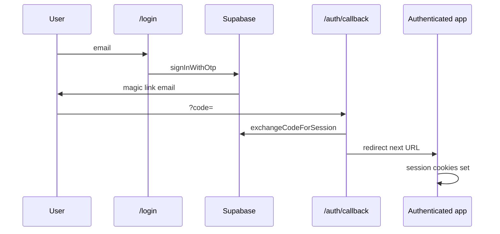

# 08 — Authentication and security

## Authentication model

The app uses **Supabase Auth** with **email magic links** (OTP). There is no password flow in the UI.



| Step | File |
|------|------|
| Sign-in UI | [webapp/components/MagicLinkAuth.tsx](../webapp/components/MagicLinkAuth.tsx), [webapp/app/login/page.tsx](../webapp/app/login/page.tsx) |
| Callback | [webapp/app/auth/callback/route.ts](../webapp/app/auth/callback/route.ts) |
| Browser client | [webapp/lib/supabase/client.ts](../webapp/lib/supabase/client.ts) |
| Server client | [webapp/lib/supabase/server.ts](../webapp/lib/supabase/server.ts) |

Configure redirect URLs in Supabase dashboard (local + production `/auth/callback`).

---

## Session refresh

[webapp/middleware.ts](../webapp/middleware.ts) runs on matched routes and calls [webapp/lib/supabase/middleware.ts](../webapp/lib/supabase/middleware.ts) to refresh the session from cookies before rendering.

---

## API authorization

Every protected API route should:

1. Check [webapp/lib/supabase/env.ts](../webapp/lib/supabase/env.ts) — `isSupabaseAuthConfigured()`
2. Call [webapp/lib/auth/require-user.ts](../webapp/lib/auth/require-user.ts) — `requireSessionUser()`

Returns `401` / `503` JSON if unauthenticated or auth not configured.

**Client gate:** [webapp/components/RequireAuth.tsx](../webapp/components/RequireAuth.tsx) uses `GET /api/auth/session` before showing `(app)` layout.

| Route | File |
|-------|------|
| Session probe | [webapp/app/api/auth/session/route.ts](../webapp/app/api/auth/session/route.ts) |
| Sign out | [webapp/app/api/auth/signout/route.ts](../webapp/app/api/auth/signout/route.ts) |

---

## Supabase clients

| Client | When to use |
|--------|-------------|
| **Server (cookies)** | Route handlers, server components — respects user JWT |
| **Browser** | Login only |
| **Authed** | [webapp/lib/supabase/authed.ts](../webapp/lib/supabase/authed.ts) — API data access; normal user session |
| **Admin (service role)** | [webapp/lib/supabase/admin.ts](../webapp/lib/supabase/admin.ts) — bypasses RLS; **restricted** |

**Admin usage in this codebase:**

- Partner unlink ([webapp/app/api/partner/unlink/route.ts](../webapp/app/api/partner/unlink/route.ts))
- Dev auth bypass data access
- Must never be exposed to the browser

---

## Dev auth bypass

[webapp/.env.example](../webapp/.env.example):

```env
AUTH_BYPASS_DEV=true
NEXT_PUBLIC_AUTH_BYPASS_DEV=true
DEV_USER_ID=<supabase-auth-user-uuid>
DEV_USER_EMAIL=you@example.com
```

[webapp/lib/auth/dev-bypass.ts](../webapp/lib/auth/dev-bypass.ts) — local only; **never** set on production Vercel.

When enabled, `createAuthedSupabaseClient` may use service role while API logic still filters by `DEV_USER_ID`.

---

## Row Level Security (RLS)

PostgreSQL enforces access per authenticated user. Application code should still pass `user_id` in queries for clarity; RLS is the backstop.

Patterns documented in [05-database-schema.md](./05-database-schema.md):

- Per-user tables: `user_id = auth.uid()`
- Household: `is_household_member(household_id)`
- `savings_transactions`: personal account owner OR pool household member

**Partner invites:** Invitee can update pending invites matching JWT email.

---

## Environment variables (security)

| Variable | Exposure | Notes |
|----------|----------|-------|
| `NEXT_PUBLIC_SUPABASE_URL` | Public | OK |
| `NEXT_PUBLIC_SUPABASE_ANON_KEY` | Public | OK with RLS |
| `SUPABASE_SERVICE_ROLE_KEY` | **Server only** | Never prefix with `NEXT_PUBLIC_` |
| `NEXT_PUBLIC_SITE_URL` | Public | Magic link redirect base |

---

## Unauthenticated endpoints

| Endpoint | Reason |
|----------|--------|
| `POST /api/quotes` | Public market data fetch (symbols in body) |

All other `/api/*` routes expect session unless returning `configured: false` when Supabase is absent.

---

## Related

- [05-database-schema.md](./05-database-schema.md) — RLS detail
- [09-development-guide.md](./09-development-guide.md) — Env setup
