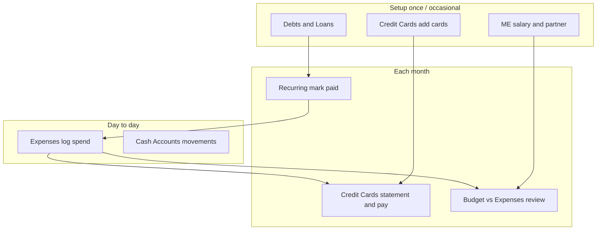

# Common workflows

Step-by-step guides for everyday tasks. Assumes you are signed in and have completed [Getting started](./getting-started.md) setup.

---

## Log a purchase against your budget

**Goal:** Record spending and see it count toward the right category (and optionally your cash or card).

1. Go to **Expenses**.
2. Use the month selector if the purchase was not this month.
3. Find the budget category (e.g. “Living & variable spend”).
4. Fill in **Date & time**, **Amount**, optional **Note**.
5. Choose **Pay from**:
   - **Cash account** — reduces that account’s balance in the app.
   - **Credit card** — adds to that card’s tracked spend on **Credit Cards** (no cash movement yet).
6. Click **Add**.

**Tip:** Existing entries in the same month already count — you don’t need to re-enter them after a settings change.

---

## Pay a credit card statement

**Goal:** Record that you paid the bank from your cash account and update the statement status.

1. On **Credit Cards**, find the card’s **Statements** row (latest closed cycle).
2. Enter **Statement amt** and **Min due** from your bank app/PDF; click **Save**.
3. Compare **Tracked** (app expenses on that card) vs **Untracked** (difference from statement — bank fees, interest, or missing logs).
4. Click **Pay**.
5. Enter payment **Amount** and **Pay from** (a cash account).
6. Confirm.

**To undo a payment:** Use **Undo payment** on the same row (only if the app still has the linked payment record).

**While still in the billing period:** Check **open cycle** “Spend” for current-cycle expenses; the statements table is for the **last closed** cycle.

---

## Mark a monthly bill as paid (loan, insurance, ILP, subscription)

**Goal:** Record that you paid this month’s obligation.

1. Go to **Recurring**.
2. Select the correct **month**.
3. Find the row (debt, insurance, ILP, or subscription).
4. Click to **record payment** (wording may vary).
5. Enter amount (pre-filled often), **date**, optional note, **Pay from**.
6. Save.

The row shows as **paid** for that month. To reverse, use **undo** / delete on that payment if available.

**Subscriptions:** Add or edit the subscription list via **Edit** on the subscriptions section (names and default amounts).

---

## Add or edit a credit card

**Goal:** Track a new card with correct billing dates.

1. Go to **Credit Cards**.
2. Click **Edit** (card configuration).
3. **Add card** or change name, bank, **Statement day**, **Payment due day**, interest rate if you track it.
4. Save.

**Statement day example:** If statement day is **21**, spending counts from the **22nd** of one month through the **21st** of the next.

The app creates a matching **pay-from** account for the card automatically when saved online.

---

## Move money between cash accounts

**Goal:** Reflect a transfer between your own accounts.

1. Go to **Cash Accounts**.
2. Use **Transfer** (or equivalent): from account, to account, amount, date.
3. Confirm.

Balances on both accounts update. The transfer also appears in **Transaction history**.

---

## Record salary or cash in

**Goal:** Increase a cash account when pay hits.

1. Go to **Cash Accounts**.
2. Select the account.
3. **Deposit** (or add transaction): amount, date, note (e.g. “Salary”).
4. Confirm.

Alternatively, ensure **ME** has salary set for planning views; actual cash still needs a deposit if you track balances here.

---

## Set up monthly budget

**Goal:** Define how much you plan to spend per category.

1. Go to **Budget**.
2. **Edit** budget lines if needed: category name, amount, type (fixed / spend / save / invest).
3. Save.

Loan and insurance totals may pull from **Debts & Loans** and **ME** automatically. Check **Expenses** later to see actual vs plan.

---

## Plan a trip

**Goal:** Budget and track travel spending.

1. Go to **Travel**.
2. **Add trip** — name, country, dates, status.
3. Open the trip.
4. Set **budget** per category (flights, hotel, food, etc.).
5. During the trip, **add expenses** with amount, date, note.
6. Review spent vs budget on the trip page.

---

## Link a partner (shared savings)

**Goal:** Share household savings pools and goals, not everyday expenses.

1. Go to **ME**.
2. In **Partner**, enter partner’s email and send invite.
3. Partner accepts from their account (email must match).
4. On **Savings & Goals**, use **shared** pools and goals.

Personal **Cash Accounts** and **Expenses** remain individual unless you both log the same thing separately.

---

## Find or fix a wrong transaction

**Goal:** Locate an entry and correct or remove it.

1. Go to **Transaction history**.
2. Filter by account, date range, or type if needed.
3. Open the row’s actions: **edit** or **delete** as offered.
4. For expenses tied to a card, deleting here should also update card tracking after refresh.

**If you deleted a card payment in history** but the statement still shows paid, you may need to adjust the statement on **Credit Cards** manually (legacy/unlinked payments).

---

## Back up your data

**Goal:** Keep a copy of your settings and data.

1. Go to **ME**.
2. Use **Export JSON** (or similar).
3. Save the file somewhere safe.

**Restore:** Use **Import JSON** on **ME** only if you understand it overwrites current data — use with caution.

---

## Review the month end-to-end

**Suggested order:**

1. **Expenses** — catch up logging; check pay-from on card spends.
2. **Recurring** — mark debt, insurance, ILP, subscriptions paid.
3. **Credit Cards** — enter statement amounts; pay from cash.
4. **Cash Accounts** — reconcile balances to bank apps.
5. **This Month Cashflow** — sanity-check in vs out.
6. **Budget** — see which categories went over.

---

## Workflow map

---

## Related

- [Pages guide](./pages.md) — What each screen shows  
- [User guide index](./README.md)
